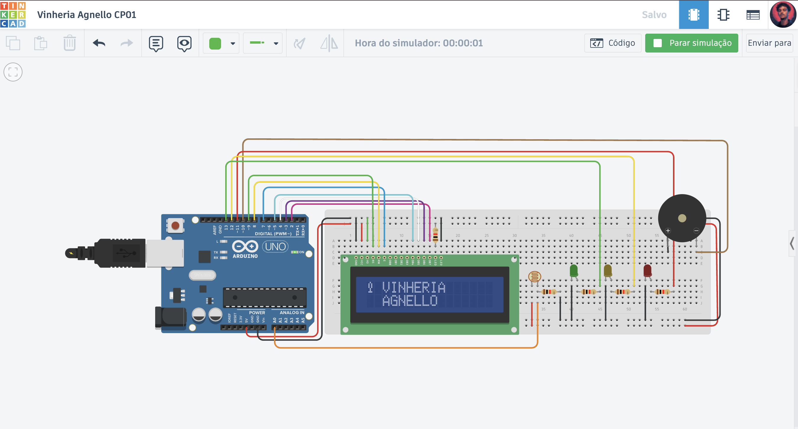

# Vinheria Agnello - CP01

## Integrantes
- Alyson Gabriel Aquino Souto

## Descrição
Projeto desenvolvido para monitorar a luminosidade do ambiente da Vinheria Agnello utilizando Arduino UNO e sensor LDR.

## 🚀 Tecnologias
- Arduino
- Tinkercad
- C++

## 🖥️ Componentes
- LCD 16x2
- LDR
- LEDs
- Buzzer

## ⚡ Funcionalidades
- Monitoramento da luminosidade
- LEDs de status
- Alarme sonoro
- Exibição em LCD

## 👨‍💻 Como executar

1. Abrir o projeto no Tinkercad

2. Iniciar a simulação

3. Alterar a luminosidade do LDR

4. Verificar LEDs, buzzer e LCD

## 🌐 Link Tinkercad
[Vinheria Agnello CP01](https://www.tinkercad.com/things/btFfqNHcUAf-vinheria-agnello-cp01?sharecode=uExsvUWWXORfzxtCuPXyIf-XG4SsKc3zWGxi4rzeAXU)

## 🌐 Vídeo
cole aqui